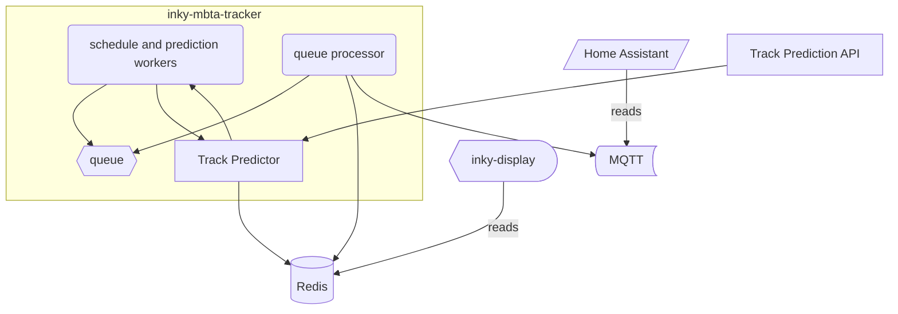

# inky-mbta-tracker

Inky MBTA Tracker is a personal project using the [Inky WHAT display](https://shop.pimoroni.com/products/inky-what?variant=21214020436051)
as a transit tracker for the Massachusetts Bay Transit Authority System.

## Features

- **Real-time Predictions**: Stream live predictions from the MBTA API
- **Static Schedules**: Fall back to static schedules when real-time data is unavailable
- **Vehicle Tracking**: Track real-time vehicle positions and status
- **Track Prediction**: **NEW!** Predict commuter rail track assignments before they're announced
- **MQTT Integration**: Publish departure information to MQTT for home automation
- **Prometheus Metrics**: Monitor system performance and API usage

## Track Prediction Feature

The track prediction system analyzes historical track assignments to predict future track assignments for MBTA commuter rail trains before they are officially announced. This helps solve the "mad scramble" problem at major stations like South Station and North Station.

### How It Works

1. **Data Collection**: The system automatically captures track assignments from the MBTA API when trains arrive at stations
2. **Pattern Analysis**: Historical data is analyzed to identify patterns based on:
   - Headsign and destination
   - Time of day and day of week
   - Direction of travel
   - Route information
3. **Prediction Generation**: Before official track announcements, the system generates predictions with confidence scores
4. **Validation**: Predictions are validated against actual track assignments to improve accuracy over time

### Using Track Predictions

Track predictions are automatically integrated into the existing display system:

- **MQTT Messages**: Track information is included in MQTT messages with indicators like:
  - `🚂 Track 5` - Confirmed track assignment
  - `🎯 Track 3?` - High confidence prediction (>80%)
  - `📊 Track 7?` - Medium confidence prediction (60-80%)
  - `🔮 Track 2?` - Low confidence prediction (30-60%)
  - `🔍 Track TBD` - No prediction available yet

- **API Access**: Use the track prediction API to get detailed information:

  ```bash
  # Get predictions for a station
  curl http://localhost:8080/predictions/place-sstat
  
  # Get prediction statistics
  curl http://localhost:8080/stats/place-sstat/CR-Providence
  
  # Get historical data
  curl http://localhost:8080/historical/place-sstat/CR-Providence?days=30
  ```

### Configuration

Add these environment variables to enable track prediction features:

```shell
# Optional: Port for track prediction API (default: 8080)
IMT_TRACK_API_PORT=8080

# Optional: Enable detailed track prediction logging
LOG_LEVEL=DEBUG
```

### Supported Stations

Track predictions work best at major commuter rail stations with multiple tracks:

- **South Station** (`place-sstat`) - All southern routes
- **North Station** (`place-north`) - All northern routes  
- **Back Bay** (`place-bbsta`) - Limited routes
- **Ruggles** (`place-rugg`) - Limited routes

### Data Storage

Historical track data is stored in Redis with the following retention:

- **Track assignments**: 6 months
- **Predictions**: 1 week
- **Statistics**: 30 days

## Architecture



At a base level, this project makes use of the MBTA V3 API, especially the [streaming API for predictions](https://www.mbta.com/developers/v3-api/streaming)
to setup individual workers for stops which are configured by the user. Optionally, a user can request static schedules via the
configuration file (explained below), and there is behavior that will retrieve static schedules if no real-time predictions are
available for a stop. From anecdotal experience the V3 streaming API appears to start dropping events after several hours
without any errors reported. Therefore, each stop watcher thread making use of the streaming API will restart after 1-3 hours
which is cleanly handled through the Python Async APIs.

This project works with [inky-display](https://github.com/cubismod/inky-display) which checks the Redis server a few times a minute
to refresh the display. Additionally, the departures can be integrated with [Home Assistant MQTT Sensors](https://www.home-assistant.io/integrations/sensor.mqtt/)
to create a real-time departure dashboard.

## Getting Started

You need a `.env` file with the following info:

```shell
AUTH_TOKEN=<MBTA_API_TOKEN> # https://www.mbta.com/developers/v3-api
IMT_CONFIG=./config.json # optional to specify a different config file
# redis config works for local dev w/ docker-compose
IMT_REDIS_ENDPOINT=127.0.0.1
IMT_REDIS_PORT=6379
IMT_REDIS_PASSWORD=mbta # change this!
IMT_ENABLE_MQTT=true/false
IMT_MQTT_HOST=127.0.0.1
IMT_MQTT_USER=username
IMT_MQTT_PASS=mqtt_pass # change this!
IMT_PROFILE_FILE=./profile.txt # optional to enable Yappi profiling around every hour
```

From there, create a `config.json` like so to the following schema:

```json5
{
  "stops": [
    {
      // REQUIRED, the stop ID which can be retrieved from the stop page like this example:
      // https://www.mbta.com/stops/place-davis
      "stop_id": "place-davis",
      // OPTIONAL, filter only arrivals going in this direction, typically 1 means that inbound
      // and 0 means outbound but that depends on the route
      // more info here: https://api-v3.mbta.com/docs/swagger/index.html#/Prediction/ApiWeb_PredictionController_index
      "direction_filter": "1",
      // OPTIONAL, filter only arrivals for the following route ID, useful if a subway station has
      // a bunch of bus routes that you don't care to track for example
      "route_filter": "Red",
      // REQUIRED, time to walk/drive/bike/etc to get to this station
      // this will be used by the display component to actually determine when
      // you can make an arrival
      "transit_time_min": 18,
      // OPTIONAL, use this for stops that never have real-time departure information
      // (looking at you with side-eye, Medford-Tufts. This will spawn a different
      // task which retrieves static schedule information every couple of hours
    }
  ]
}
```

## Prometheus & Grafana

Prometheus is available at port 8000.

You can use my [dashboard JSON](./grafana-dashboard.json) for a Grafana dashboard combining
the Prom metrics & a Loki datasource for logs.


## Running

Spin up the local Redis server using the provided docker compose file.

Then run `task run` to start up the tracker.
