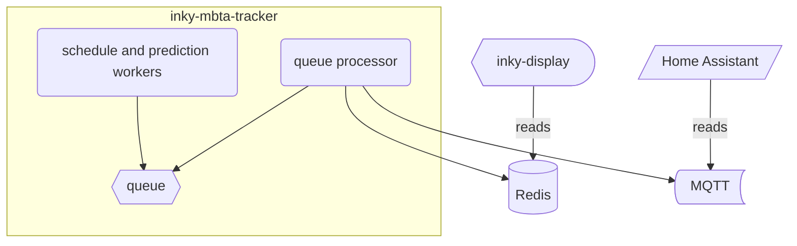

# inky-mbta-tracker

Inky MBTA Tracker is a personal project using the [Inky WHAT display](https://shop.pimoroni.com/products/inky-what?variant=21214020436051)
as a transit tracker for the Massachusetts Bay Transit Authority System.

## Architecture



At a base level, this project makes use of the MBTA V3 API, especially the [streaming API for predictions](https://www.mbta.com/developers/v3-api/streaming)
to setup individual workers for stops which are configured by the user. Optionally, a user can request static schedules via the
configuration file (explained below), and there is behavior that will retrieve static schedules if no real-time predictions are
available for a stop. From anecdotal experience the V3 streaming API appears to start dropping events after several hours
without any errors reported. Therefore, each stop watcher thread making use of the streaming API will restart after 1-3 hours
which is cleanly handled through the Python Async APIs.

This project works with [inky-display](https://github.com/cubismod/inky-display) which checks the Redis server a few times a minute
to refresh the display. Additionally, the departures can be integrated with [Home Assistant MQTT Sensors](https://www.home-assistant.io/integrations/sensor.mqtt/)
to create a real-time departure dashboard.

## Getting Started
You need a `.env` file with the following info:

```shell
AUTH_TOKEN=<MBTA_API_TOKEN> # https://www.mbta.com/developers/v3-api
IMT_CONFIG=./config.json # optional to specify a different config file
# redis config works for local dev w/ docker-compose
IMT_REDIS_ENDPOINT=127.0.0.1
IMT_REDIS_PORT=6379
IMT_REDIS_PASSWORD=mbta # change this!
IMT_ENABLE_MQTT=true/false
IMT_MQTT_HOST=127.0.0.1
IMT_MQTT_USER=username
IMT_MQTT_PASS=mqtt_pass # change this!
IMT_NTFY=true # set to true if you want to receive alert notifications via ntfy
IMT_NTFY_ENDPOINT=my-ntfy-server.com/topic
IMT_NTFY_AUTH=tk_ntfy_token_here
```

From there, create a `config.json` like so to the following schema:
```json5
{
  "stops": [
    {
      // REQUIRED, the stop ID which can be retrieved from the stop page like this example:
      // https://www.mbta.com/stops/place-davis
      "stop_id": "place-davis",
      // OPTIONAL, filter only arrivals going in this direction, typically 1 means that inbound
      // and 0 means outbound but that depends on the route
      // more info here: https://api-v3.mbta.com/docs/swagger/index.html#/Prediction/ApiWeb_PredictionController_index
      "direction_filter": "1",
      // OPTIONAL, filter only arrivals for the following route ID, useful if a subway station has
      // a bunch of bus routes that you don't care to track for example
      "route_filter": "Red",
      // REQUIRED, time to walk/drive/bike/etc to get to this station
      // this will be used by the display component to actually determine when
      // you can make an arrival
      "transit_time_min": 18,
      // OPTIONAL, use this for stops that never have real-time departure information
      // (looking at you with side-eye, Medford-Tufts. This will spawn a different
      // task which retrieves static schedule information every couple of hours
    }
  ]
}
```

## Running

Spin up the local Redis server using the provided docker compose file.

Then run `task run` to start up the tracker.