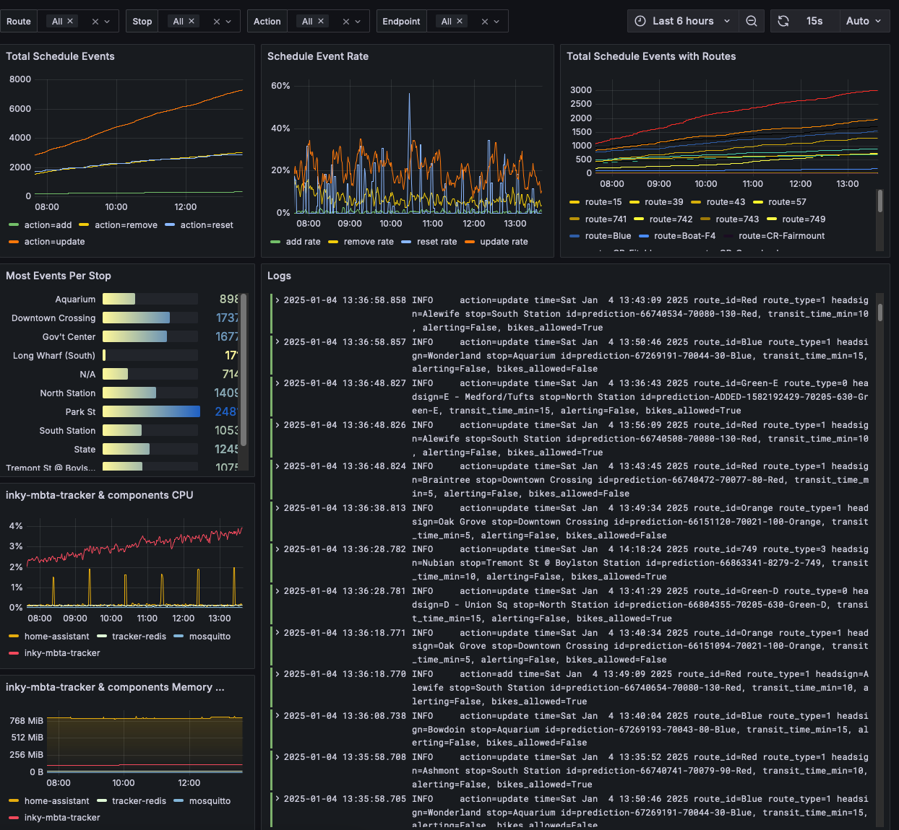
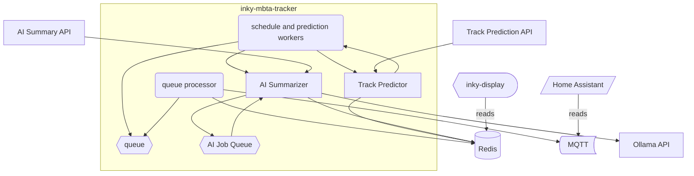

# inky-mbta-tracker

Inky MBTA Tracker or IMT is a multi-purpose, async Python application tracking the
Massachusetts Bay Transit Authority. It relies on Redis for data storage in conjunction with
[inky-display](https://github.com/cubismod/inky-display) for e-inky display functionality. Additionally,
it provides a comprehensive API using FastAPI which serves [ryanwallace.cloud](https://ryanwallace.cloud).


## Configuring

## Getting Started

You need a `.env` file with the following info:

```shell
# MBTA API Configuration
AUTH_TOKEN=<MBTA_API_TOKEN> # https://www.mbta.com/developers/v3-api

# Application Configuration
IMT_CONFIG=./config.json # optional to specify a different config file
IMT_LOG_FILE=./logs/inky.log # optional to also log to a file
LOG_LEVEL=info
IMT_COLOR=true  # to log with colors
IMT_REDIS_BACKUP_TIME=21:50 # set to backup every night at this time, you are responsible for cleaning up backups
# use these settings for real time self-monitoring health checks via prometheus
IMT_PROMETHEUS_JOB="imt_dev"
IMT_PROMETHEUS_ENDPOINT="http://prometheus.local"
IMT_METRIC_NAME="mbta_server_side_events:rate5m"

# monitoring with Pyroscope (optional)
IMT_PYROSCOPE_ENABLED=true
IMT_PYROSCOPE_HOST=http://pyroscope.local
IMT_PYROSCOPE_NAME=inky-local

# Redis Configuration (required)
IMT_REDIS_ENDPOINT=127.0.0.1
IMT_REDIS_PORT=6379
IMT_REDIS_PASSWORD=mbta # change this!

# MQTT Configuration
IMT_ENABLE_MQTT=true/false
IMT_MQTT_HOST=127.0.0.1
IMT_MQTT_USER=username
IMT_MQTT_PASS=mqtt_pass # change this!

# API Timeouts
IMT_API_REQUEST_TIMEOUT=30 # API request timeout in seconds
IMT_TRACK_PREDICTION_TIMEOUT=15 # Track prediction timeout in seconds

# Feature Flags
IMT_RATE_LIMITING_ENABLED=true # Enable/disable rate limiting
IMT_SSE_ENABLED=true # Enable/disable Server-Sent Events

# Ollama AI Summarizer Configuration
OLLAMA_BASE_URL=http://localhost:11434 # Ollama API endpoint
OLLAMA_MODEL=llama3.2:1b # Model to use for summarization
OLLAMA_TIMEOUT=30 # Request timeout in seconds
OLLAMA_TEMPERATURE=0.1 # Model creativity (0.0=focused, 1.0=creative)
```

## Prometheus & Grafana

Prometheus is available at port 8000.

New metric: `imt_track_predictions_ml_wins` — counts how often the live ML vs. historical/pattern comparison chose the ML result. Metric labels are `station_id`, `route_id`, and `instance`. This is exposed alongside the other `imt_` metrics on the same Prometheus endpoint.

You can use my [dashboard JSON](./grafana-dashboard.json) for a Grafana dashboard combining
the Prom metrics & a Loki datasource for logs.



## Running

Spin up the local Redis server using the provided docker compose file.

Then run `task run` to start up the tracker.

Note: On Linux/macOS, `uvloop` is enabled automatically when available for faster asyncio performance. If not present, the default loop is used.

## ML Track Prediction (optional)

The ML ensemble for track prediction is optional and off by default. To enable it:

- Environment
  - `IMT_ML=true` to enable the ML worker
  - `KERAS_BACKEND=jax` to use the Keras-on-Jax backend

- Behavior at a glance
  - ML runs asynchronously; the predictor never blocks waiting for ML.
  - The ML worker writes a `TrackPrediction` to Redis and clears any corresponding `negative_…` cache key to avoid suppression.
  - Predictions with confidence below 25% are filtered out (hard floor).
  - Confidence combines margin‑based probability, optional sharpening, historical accuracy, and (when available) Bayes fusion with latest ML outputs.

- Tuning (env vars)
  - `IMT_ML_CONF_GAMMA` (default `1.3`): probability sharpening factor used for display confidence.
  - `IMT_CONF_HIST_WEIGHT` (default `0.3`): blend weight for historical accuracy into display confidence.
  - `IMT_BAYES_ALPHA` (default `0.65`): weight for pattern vs. ML in Bayes fusion.
  - `IMT_ML_SAMPLE_PCT` (default `0.10`): % of successful traditional predictions also queued to ML for exploration.
  - `IMT_ML_REPLACE_DELTA` (default `0.05`): minimum ML confidence improvement to overwrite an existing non‑ML prediction.
  - `IMT_ML_COMPARE` (default `false`): when `true` the predictor will attempt a short live comparison between the traditional/pattern result and the ML ensemble and choose the higher-confidence result. This is opt-in to avoid blocking the prediction flow.
  - `IMT_ML_COMPARE_WAIT_MS` (default `200`): maximum time in milliseconds to wait for a recent ML result when `IMT_ML_COMPARE` is enabled. If no ML result is produced within this window the predictor falls back to the traditional result and continues (the ML worker still runs asynchronously).

- Observability
  - New Prometheus metric: `imt_track_predictions_ml_wins` — counts how often the live ML vs. pattern comparison chose the ML result. Labels: `station_id`, `route_id`, `instance`.

## Track Prediction Feature

The track prediction system analyzes historical track assignments to predict future track assignments for MBTA commuter rail trains before they are officially announced. This helps solve the "mad scramble" problem at major stations like South Station and North Station.

### How It Works

1. **Data Collection**: The system automatically captures track assignments from the MBTA API when trains arrive at stations
2. **Pattern Analysis**: Historical data is analyzed to identify patterns based on:
   - Headsign and destination
   - Time of day and day of week
   - Direction of travel
   - Route information
3. **Prediction Generation**: Before official track announcements, the system generates predictions with confidence scores
4. **Validation**: Predictions are validated against actual track assignments to improve accuracy over time

### Using Track Predictions

Track predictions are automatically integrated into the existing display system:

- **API Access**: Use the track prediction API to get detailed information:

  ```bash
  # Get predictions for a station
  curl http://localhost:8080/predictions/place-sstat

  # Get prediction statistics
  curl http://localhost:8080/stats/place-sstat/CR-Providence

  # Get historical data
  curl http://localhost:8080/historical/place-sstat/CR-Providence?days=30
  ```

### Configuration

Add this environment variable to enable track prediction features:

```shell
# Optional: Port for track prediction API (default: 8080)
IMT_TRACK_API_PORT=8080
```

#### Track Prediction Precaching

To enable automatic track prediction precaching, add these fields to your `config.json`:

```json
{
  "enable_track_predictions": true,
  "track_prediction_routes": ["CR-Worcester", "CR-Providence"],
  "track_prediction_stations": ["place-sstat", "place-north", "place-bbsta"],
  "track_prediction_interval_hours": 2
}
```

- `enable_track_predictions`: Boolean to enable/disable precaching (default: false)
- `track_prediction_routes`: List of commuter rail routes to precache (optional, defaults to all CR routes)
- `track_prediction_stations`: List of station IDs to precache for (optional, defaults to major stations)
- `track_prediction_interval_hours`: Hours between precaching runs (default: 2)

Note that you will also need to add the following stations to your configuration:

```json
  "stops": [
    {
      "stop_id": "place-north",
      "show_on_display": false,
      "transit_time_min": 1,
    },
    {
      "stop_id": "place-sstat",
      "show_on_display": false,
      "transit_time_min": 1
    },
    {
      "stop_id": "place-bbsta",
      "show_on_display": false,
      "transit_time_min": 1
    }
  ]
```

This creates real time departure/arrival trackers for these stations which is required to generate track predictions
but it doesn't show them on the Inky display or in MQTT.

## Architecture



At a base level, this project makes use of the MBTA V3 API, especially the [streaming API for predictions](https://www.mbta.com/developers/v3-api/streaming)
to setup individual workers for stops which are configured by the user. Optionally, a user can request static schedules via the
configuration file (explained below), and there is behavior that will retrieve static schedules if no real-time predictions are
available for a stop. From anecdotal experience the V3 streaming API appears to start dropping events after several hours
without any errors reported. Therefore, each stop watcher thread making use of the streaming API will restart after 1-3 hours
which is cleanly handled through the Python Async APIs.

This project works with [inky-display](https://github.com/cubismod/inky-display) which checks the Redis server a few times a minute
to refresh the display. Additionally, the departures can be integrated with [Home Assistant MQTT Sensors](https://www.home-assistant.io/integrations/sensor.mqtt/)
to create a real-time departure dashboard.
